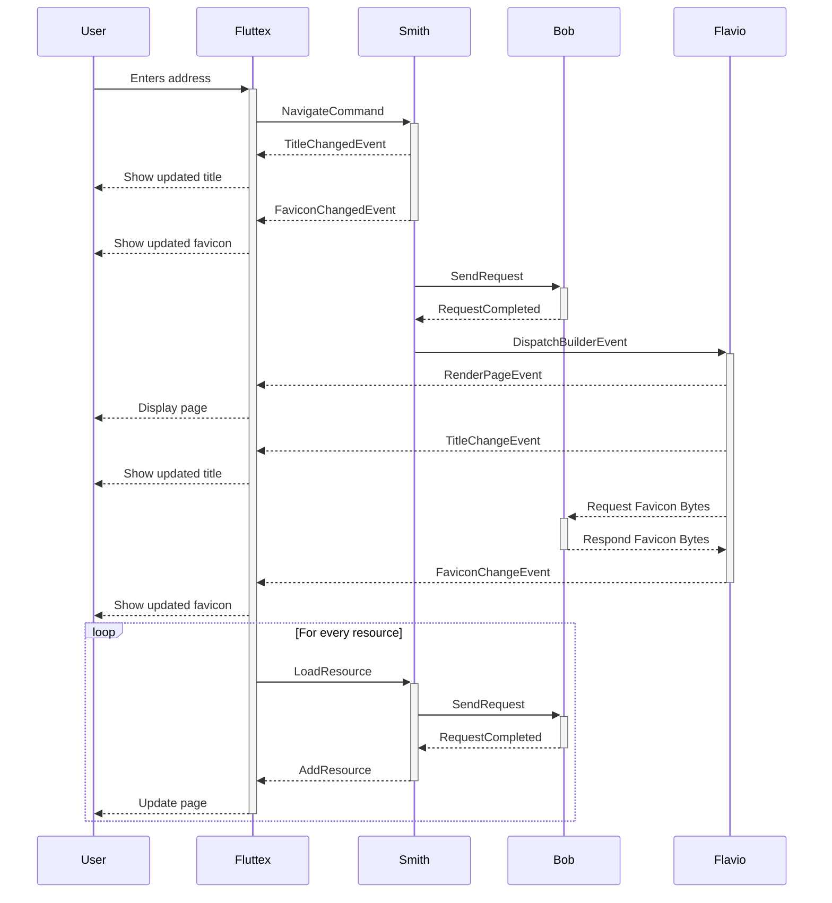

# Fluttex Browser Architecture

## Actors

- User: the person using the app
- Fluttex: the entrypoint and main scaffolding of the app with fixed UI elements
- Agent: the layer handling events from the UI, issuing commands to the renderer, dispatching requests to the backend and handling the results
- Renderer: the engine responsible for building an interactive page using the commands given by the browser and passing events back to the agent
- Backend: the engine processing requests and handling the responses
- Sandbox: an environment in which the browser can run Lua and Dart code

All actors communicate via a central message bus (https://pub.dev/packages/event_bus).

### Fluttex

- Composes the scaffolding of the app
- Provides the user with the ability to enter an address and other standard browser features

### Agent (Smith)

- Takes in commands from the UI and decides how to handle them
- Holds the DOM

### Renderer (Flavio)

- Builds an interactive page using information from the agent
- Passes events back to the agent on user interaction
- Converts:
  - HTML to a tree of widgets
  - Code/CSS/Text to (maybe in the future: syntax highlighted) text
  - Images to a widget
- Requests additional resources from the agent if required by the HTML

### Backend (Bob)

- Processes requests and handles responses
- Resolves URLs and handles DNS

### Sandbox (Sandy)

- Runs Lua and Dart code
- Provides a sandboxed environment for the code to run in
- Provides a standard interface for the code to interact with the agent and the DOM

## Example interaction

